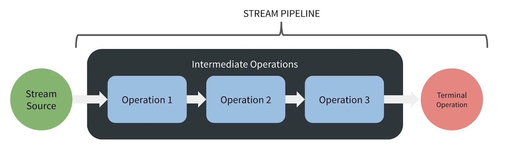

# 함수형 데이터 파이프라인으로써의 스트림

---

**선언적 접근법**
- 단일 호출 체인을 통해 간결하고 명료한 다단계 데이터 파이프라인 구축이 가능하다.

**조합성**
- 더이터 처리 로직을 위한 고차 함수로 이루어져 있으며, 필요에 따라 조합하여 사용할 수 있다.

**지연 처리**
- 중간 연산이 즉시 수행되지 않고, 최종 연산이 호출될 때까지 지연되는 특성을 가진다.
- 필요하지 않은 연산은 건너뛰고, 필요한 연산만 수행하여 `성능을 최적화`할 수 있다.
```java
List<String> list = Arrays.asList("apple", "banana", "apricot", "orange");

Stream<String> stream = list.stream()
                            .filter(s -> {
                                System.out.println("filter: " + s);
                                return s.startsWith("a");
                            })
                            .map(s -> {
                                System.out.println("map: " + s);
                                return s.toUpperCase();
                            });

System.out.println("중간 연산은 실행되지 않는다.");
List<String> result = stream.collect(Collectors.toList());
System.out.println("최종 연산");
System.out.println(result);
// 중간 연산은 실행되지 않는다.
// filter: apple
// map: apple
// filter: banana
// filter: apricot
// map: apricot
// filter: orange
// 최종 연산
// [APPLE, APRICOT]
```

**병렬 데이터 처리**
- 스트림의 요소들을 병렬로 분할하여 처리함으로써, 대용량 데이터를 효율적으로 처리할 수 있다.

### 자바 스트림 기본 개념

**스트림 생성**
- 기존의 데이터 소스에서 스트림을 생성한다.
- 특정 타입에 국한되지 않고, 연속적인 요소를 제공할 수 있다면 스트림으로 변환할 수 있다.

**작업 수행**
- 필터링, 매핑, 정렬 등의 여러 작업을 수행한다.
- 각 연산은 `새로운 스트림을 반환`한다. -> 불변성을 보장한다.

**결과 반환**
- 파이프라인을 완료하기 위해 스트림 대신 결과를 반환하는 종료 연산(Terminal Operations)이 필요하다.
- collect(컬렉션 반환), forEach(동작 수행), toArray(배열 반환) 등이 있다.



## 스트림 특성

**느긋한 계산법**
- 결과가 실제로 필요한 시점까지 지연시키는 계산 전략으로, 표현식을 어떻게 생성하는지와 해당 표현식을 언제 사용하는지에 대한 문제를 분리하는 개념(ch01)
- 스트림에서 중간 연산을 수행할 때 즉각적으로 실행되지 않는다.
- 대신 해당 호출은 파이프라인을 확장하고 새롭게 지연 평가된 스트림을 반환한다.
- 스트림 요소의 흐름은 `깊이 우선` 방식을 따른다.
    - 한 요소가 시작부터 끝까지 완전히 처리된 후에 다음 요소가 처리되는 방식
    - 각 요소가 순차적으로 처리되므로, 메모리 사용이 효율적이다.

**상태 및 간섭 없음**
- 스트림의 중간 연산은 대부분 상태를 갖지 않고 파이프라인의 다른 부분과 독립적으로 작동하며 현재 처리 중인 요소에만 접근한다.
- 스트림은 간섭하지 않고 통과하는 파이프라인이다.
> 중간 연산의 상태를 가질 수 있지만 파이프라인에서 동작하는 인수들은 순수 함수로 설계하는 것이 좋다.<br>
> 상태에 의존하는 것은 안전성과 성능에 영향을 주며, 의도치 않은 사이드 이펙트가 발생할 수 있다.

**최적화**
- 일반적인 for나 while 같은 루프로도 높은 최적화가 가능하다.
- 스트림 사용 시 파이트라인은 각 호출마다 새로운 스택 프레임을 필요로하고 오버헤드의 단점이 있다.
- 그럼에도 스트림을 사용하는 것은 코드의 간결성, 가독성, `가변성 방지와 안전성 보장`의 이유 때문이지 않을까

**재사용 불가능**
- 스트림 파이프라인은 단 한 번만 사용할 수 있다. 종료 연산이 호출된 후 정확히 한 번만 전달된다.
- 스트림을 다시 사용하려 하면 IllegalStateException이 발생한다.
- 소스 데이터를 변경하거나 영향을 주지 않기 때문에 항상 동일한 소스 데이터로부터 다른 스트림을 생성할 수 있다.
```java
List<String> list = Arrays.asList("apple", "banana", "apricot", "orange");

Stream<String> originStream = list.stream();

List<String> newList = originStream
        .filter(s -> !s.startsWith("a"))
        .filter(s -> s.length() > 5)
        .collect(Collectors.toList()); // 종료 연산 호출

System.out.println(newList); // [banana, orange]

// 재사용
List<String> recycleStream = originStream
        .map(s -> s.toUpperCase())
        .collect(Collectors.toList());

System.out.println(recycleStream);
// Exception in thread "main" java.lang.IllegalStateException: 
// stream has already been operated upon or closed
```

**원시 스트림**
- 원시 타입 처리의 특수화된 변형을 통해 오토박싱 오버헤드를 줄인다.

**병렬 처리**
- 파이프라인 내에서 parallel 메서드를 호출하는 것만으로 가능하다.
- 하지만 스트림의 병렬 처리는 충분한 데이터(대용량)를 포함해야 하며, 연산이 여러 스레드의 오버헤드를 수용할 만큼의 비용을 감당할 수 있어야 한다.

## Spliterator - 분할 반복자
- 일반적인 반복 루프는 Iterator<T> 타입을 기반으로 요소들을 순회한다.
- 스트림은 자체 반복 인터페이스인 Spliterator를 사용한다.
- Spliterator는 자동으로 스트림을 분할 하는 기법으로 Iterator 처럼 소스의 요소 탐색 기능을 제공한다는 점은 같지만 Spliterator는 병렬 작업에 특화되어 있다.
> Spliterator 는 splitable iterator 의 의미로 분할할 수 있는 반복자 라는 의미

**trySplit**
```java
List<String> list = Arrays.asList("apple", "banana", "apricot", "orange");

// Spliterator 생성
Spliterator<String> spliterator1 = list.spliterator();

// Spliterator 분할
Spliterator<String> spliterator2 = spliterator1.trySplit();

// Spliterator 분할
Spliterator<String> spliterator3 = spliterator2.trySplit();

// Spliterator 분할 -> null
Spliterator<String> spliterator4 = spliterator3.trySplit();

spliterator1.forEachRemaining(System.out::println); // apricot, orange
spliterator2.forEachRemaining(System.out::println); // banana
spliterator3.forEachRemaining(System.out::println); // apple
spliterator4.forEachRemaining(System.out::println); // NullPointerException
```
- trySplit()은 Spliterator를 대략 절반으로 분할하여 새로운 Spliterator를 반환한다.
    - Spliterator를 구현하고, trySplit()를 재정의하여 분할 기준을 나눌 수 있다.
    - ArrayList의 ArrayListSpliterator는 중간 지점을 기준으로 분할한다.
    - 더이상 분할이 불가능하다면 null을 반환한다.

**tryAdvance**
```java
public static void main(String[] args) {
    List<String> list = Arrays.asList("apple", "banana", "apricot", "orange");

    // Spliterator 생성 
    Spliterator<String> spliterator1 = list.spliterator();

    // Spliterator 분할
    Spliterator<String> spliterator2 = spliterator1.trySplit();

    // spliterator1 처리
    processSpliterator(spliterator1);
    System.out.println("=======");

    if (spliterator2 != null) {
        // spliterator2 처리
        processSpliterator(spliterator2);
        Spliterator<String> spliterator3 = spliterator2.trySplit();
        if (spliterator3 != null) {
            // spliterator3 처리
            System.out.println("======");
            processSpliterator(spliterator3);
        }
    }
}

// 파라미터 spliterator에 요소가 있다면 처리
private static void processSpliterator(Spliterator<String> spliterator) {
    Consumer<String> action = System.out::println;
    while (spliterator.tryAdvance(action));
}
```
- tryAdvance()는 요소를 하나씩 처리할 때 사용된다.
    - spliterator에 다음 요소가 존재하면 해당 요소를 처리하고 true를 반환하고, 요소가 없다면 false를 반환한다.

Spliterator는 주로 대량의 데이터를 처리할 때 성능을 최적화하기 위해 스트림 내부적으로 사용된다.