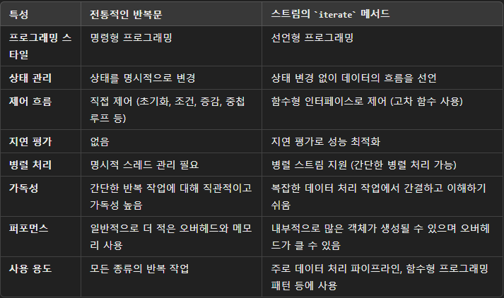

# 스트림 사용하기

---

## 원시 스트림
- 자바에서 제네릭은 객체 기반 타입에서만 작동한다.
- Stream<T>는 int와 같은 기본값 시퀀스에 사용될 수 없다.
- 자바는 원시 타입과 그에 상응하는 객체 타입 간의 자동 변환(오토박싱)을 지원한다.
```java
Stream<Long> longStream = Stream.of(5L, 23L, 42L);
```

### 오토박싱의 문제 

**원시 타입의 값을 객체로 변환할 때 오버헤드가 발생.**
- 스트림 파이프라인에서 래퍼 타입의 지속성인 생성으로 인해 오버헤드가 누적될 수 있다.

**null 값의 존재 가능성**
- 원시 타입을 객체로 바로 변환할 때는 null이 생기지 않는다.
- 파이프라인 내의 특정 연산에서 래퍼 타입을 처리해야한다면 null 값이 반환될 가능성이 있다.

일반적으로 원시 스트림을 사용하는 경우는 최적화를 위해 대규모 데이터를 병렬 처리할 때이다.

간단한 상황에서는 기존의 처리 방식과 비교하여 원시 스트림을 사용하는 것이 큰 이점을 가져다주지는 않는다.

## 반복 스트림 
- 전통적인 반복문과 스트림 iterate 반복의 차이



## 무한 스트림
- 데이터의 무한 시퀀스를 생성할 수 있다.
- 스트림의 느긋한 특성으로 인해 모든 요소를 메모리에 올리지 않고 필요할 때만 요소를 생성할 수 있다.

### 메모리 한정
무한 스트림 구현 중 제한 없이 중간 연산이나 최종 연산을 사용하지 않는다면 결국 OutOfMemoryError가 발생한다.

- 중간 연산 : limit, takeWhile
- 최종 연산(보장됨) : findFirst, findAny()
- 최종 연산(보장되지 않음) : anyMatch, allMatch, noneMatch

가장 직관적인 선택은 limit이다. 

'-'Match 연산은 takeWhile 과 동일한 문제를 가지고 있는데,<br>
연산의 조건이 목적과 부합하지 않는다면 파이프라인 은 끝없이 무한한 수의 요소를 처리할 것이다.<br>

스트림에서 제한 연산의 위치는 스트림을 통과하는 요소의 수에도 영향을 준다.<br>
결과는 동일하더라도, 빠르게 스트림 요소 흐름을 제한함으로써 메모리를 보다 효율적으로 사용할 수 있다.


  