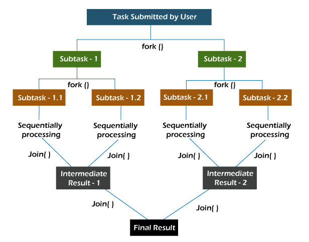

# 스트림을 활용한 병렬 데이터 처리

---

## 동시성 병렬성

**동시성**
- 여러 작업이 중복되는 시간 동안 한정된 리소스에 대한 경쟁을 하면서 실행되는 것을 의미
- 실제로 작업이 동시에 실행되지는 않지만 단일 CPU 코어에서는 작업 간 전환이 빨라 동시에 실행되는 것처럼 보인다.
- 동시성은 I/O 작업을 처리할 때 효율적인데, I/O 요청 후 응답까지의 대기 시간(CPU 대기 시간) 중에 다른 작업을 처리할 수 있기 때문이다.
- 하지만 여러 작업을 동시에 수행하므로 `경합 상태`, `데드락`, `기아` 등의 동기화 문제가 발생할 수 있다.

**병렬성**
- 중첩된 작업들을 관리하는 것이 아닌, 작업들이 `동시에 실행`되는 것에 중점을 둔다.
- 여러 개의 CPU 코어를 사용할 수 있는 경우 각각의 작업들은 서로 다른 코어에서 병렬로 실행될 수 있다.
- 병렬성은 CPU 바운드 작업에 적합하다. CPU 바운드 작업이란 주로 CPU의 계산 능력에 의해 작업 속도가 결정되는 작업을 말한다.
- 대규모 수학 계산, 빅데이터 처리와 같은 큰 작업을 여러 작은 부분으로 나누어 멀티 코어에서 동시에 처리할 수 있다. 이를 통해 작업의 처리 시간을 줄이고 성능 향상의 이점을 준다.

동시성은 한 번에 여러 작업을 처리하는 것을 의미하고, 병렬성은 한 번에 여러 작업을 실행하는 것을 의미한다.

동시성을 가진 구조로 설계하고, 그 구조를 병렬적인 실행방식으로 구현한다.

## 병렬 함수 파이프라인으로써의 스트림
- 스트림은 중간 스트림 연산인 parallel 을 사용하여 병렬 모드로 전환할 수 있다.
- parallel을 호출하여 실행 모드를 변경하면 파이프라인 내의 위치에 관계 없이 전체 스트림 파이프라인에 영향을 미친다.
- 최종 연산 전에 마지막으로 호출된 메서드가 전체 파이프라인의 실행 모드를 결정한다.
```java
List<Integer> parallelNumbers = Arrays.asList(1, 2, 3, 4, 5, 6, 7, 8, 9, 10);

List<Integer> result = parallelNumbers.stream()
        .filter(n -> n % 2 == 0)
        .map(n -> n * n)
        .parallel() // 병렬 모드 전환
        .collect(Collectors.toList());

System.out.println(result);
// [4, 16, 36, 64, 100]
```
- filter와 map 연산은 메인 스레드에서 수행된다.
- parallel 호출로 병렬모드로 전환되고 최종연산인 collect은 병렬 모드로 수행된다.

### 병렬 스트림
- 병렬 스트림은 재귀적 분해 개념을 사용. 
- spliterator로 분할하여 요소의 덩어리를 병렬 처리함으로써 데이터 소스를 `분할하고 정복`하는 것을 의미
  - 분할된 덩어리는 전용 스레드에 의해 처리되며 재귀적으로 더 분할될 수 있다.
- 분할되어 처리된다하여, 별도로 스레드를 만들거나 관리하는 등의 작업을 할 필요는 없다.
  - `스트림 API는 내부적으로 ForkJoinPool 을 활용`하여 스레드를 효과적으로 생성하고 관리하기 때문
> ForkJoinPool
- 작업 훔치기 방식으로 스레드를 실행.
- 한 작업 스레드가 자신에게 할당된 작업을 마친 후, 다른 스레드가 아직 처리하지 못한 작업을 훔쳐와서 실행한다.
- ForJoinPool 은 런타임에서 자체적으로 관리하며, 초기화가 지연되는 정적 스레드 풀이다.
- 모든 CPU 코어를 동시에 과도하게 사용하는 상황을 피한다.



## 병렬 스트림 활용
- 단일 스레드에서의 작업 시간과 병렬 스트림을 사용하여 작업한 시간을 비교한 예제
```java
List<Integer> numbers = new ArrayList<>();
for (int i = 0; i < 1_000_000; i++) {
    numbers.add(i);
}

// 단일 스레드 처리 시간 측정
long startTime = System.nanoTime();
/*int[] singleThreadMultiple1 = numbers.stream()
        .mapToInt(n -> n * n)
        .toArray();*/
Object[] singleThreadMultiple2 = numbers.stream()
        .map(n -> n * n)
        .toArray();
long singleThreadTime = System.nanoTime() - startTime;

System.out.println("단일 스레드 처리 시간: " + singleThreadTime / 1_000_000.0 + " ms");

// 병렬 스트림 처리 시간 측정
startTime = System.nanoTime();
/*int[] multiThreadMultiple1 = numbers.parallelStream()
        .mapToInt(n -> n * n)
        .toArray();*/
Object[] multiThreadMultiple2 = numbers.parallelStream()
        .map(n -> n * n)
        .toArray();
long parallelStreamTime = System.nanoTime() - startTime;

System.out.println("병렬 스트림 처리 시간: " + parallelStreamTime / 1_000_000.0 + " ms");

if (singleThreadTime < parallelStreamTime) {
    System.out.println("단일 승");
} else {
    System.out.println("멀티 승");
}

// 기본 타입 배열 -> 단일: 11.7893 ms  <  병렬: 59.07 ms
// 객체 타입 배열 -> 단일: 46.7091 ms  >  병렬: 32.0836 ms
```
- mapToInt를 사용하여 기본 타입의 배열로 반환하는 스트림이라면 단일 스레드가 더 빠르다.
- map을 사용하여 Object 타입의 배열로 반환한 스트림인 경우는 멀티 스레드가 더 빠르다.
  - 단일 스레드에서 객체타입으로 반환하는 중에 오토박싱 오버헤드가 영향을 준 것 같다.

## 병렬 스트림 활용 시기와 주의할 점
- 병렬 스트림을 사용하는 것이 항상 성능 향상을 보장하지 않는다.
  - 다양한 요소에 영향을 받을 수 있기 때문
  - 작업의 성격(CPU 바운드, I/O 바운드), 데이터 특성(데이터 크기, 분포), 하드웨어 사양(CPU 코어 수, 메모리 용량), `컨텍스트 스위칭 오버헤드`
- 병렬 스트림의 주된 목적은 성능 최적화를 위한 것이므로 메서드 호출이 편리하다는 이유로 막연하게 사용하는 것은 좋지 않다.

병렬과 순차 데이터 처리 방식 중 어떤 것을 선택할지에 대한 절대적인 기준은 없지만, 몇가지 기준점을 제공하는 지침이 존재

### 적절한 데이터 소스 선택
- 스트림은 Spliterator에 의해 처리되는 데이터 소스로부터 시작된다.
- 순차 스트림의 경우 Spliterator는 단순 반복자의 역할을 하며, 병렬 스트림에서는 데이터 소스가 여러 부분으로 나눠진다.
- 데이터 소스 분해 과정에서 비슷한 크기로 나누어져 작업이 균등하게 분배되어야 하지만, 데이터 소스 특성에 따라 그렇지 않을 수 있다.
- 데이터 소스와 병렬 스트림에서 성능에 영향을 주는 요소들 중 `데이터 지역성`이 있다.

> 데이터 지역성
- 프로세서가 메모리에서 데이터를 읽거나 쓸 때 데이터 접근의 효율성을 높이기 위해 고려되는 개념.
- 최근에 접근한 데이터에 다시 접근할 가능성이 높은 패턴인 `시간적 지역성`
- 한 번 접근된 데이터 근처에 있는 데이터에 곧 접근할 가능성이 높은 패턴인 `공간적 지역성`


**배열 기반 데이터 소스 - ArrayList**
- 내부적으로 배열을 사용하므로, 데이터가 연속된 메모리 블록에 저장된다. 데이터 접근이 빠르고, 캐시 효율성이 높다.
- 인덱스를 기반으로 데이터를 쉽게 분해할 수 있다.
- ArrayList의 요소는 `상대적으로` 불변성이 유지되므로, 병렬 처리 시 데이터 일관성을 유지하는 데 유리하다.

**순차적 데이터 소스 - LinkedList**
- 각 노드가 독립적으로 메모리에 저장되므로 데이터 접근 패턴이 비효율적이다.
- 각 노드를 따라가면 분할해야 하므로 오버헤드가 크다.
- LinkedList는 요소 추가, 삭제가 빈번히 발생할 수 있는데, 병렬 처리 시 작업을 동기화해야 하므로 추가적인 비용이 발생한다.

> 데이터 지역성은 병렬 처리에 적합한 데이터 소스를 선택하는 데 고려해야 하는 여러 기준 중 하나이다.
> 하지만 다른 기준들에 비해서 상대적으로 중요도가 낮으며 런타임과 JDK가 데이터를 저장하는 방법을 제어할 수 없다.

## 요소의 개수
- 병렬 스트림에서는 처리해야 할 요소가 많을수록 성능 향상에 더 유리하다.
- 병렬 처리를 위해 먼저 요소를 분할하여 처리한 후 최종 결과를 얻기 위해 다시 결합해야 한다.
- 이러한 과정의 균형을 찾기 위해 NQ모델을 제시.

### NQ 모델
- N은 요소의 수, Q는 단일 작업에 소요되는 비용
- N * Q는 병렬 처리로 속도를 얼마나 향상시킬 수 있을 지를 나타내는 지표이다.
- 요소의 수, 작업 비용이 높을 수록 병렬 스트림을 사용하는 것이 유리하다.

## 스트림 연산
- 병렬 연산 설계의 주요 목표는 순차 스트림과 동일한 결과를 얻는 것이다.
- 함수적 원칙과 병렬 처리에 유리한 연산 방식을 준수하는 것이 중요하다.

### 순수한 람다
- 람다가 지역 외부의 변경 가능한 상태에 의존하거나 사이드 이펙트를 발생시키면 안된다.

### 병렬 처리에 적합한 연산
- 스트림의 요소에 대한 접촉 순서에 의존하는 정도에 따라 병렬 처리에 적합한지 알 수 있다.
- limit, skip, distinct 같은 중간 연산은 요소의 접촉 순서에 많은 의존성을 가진다.
  - 그러나 이러한 안정성을 확보하기 위해 모든 스레드 간의 동기화와 메모리 요구량이 증가하기 때문에 추가 비용이 필요하다.