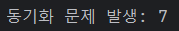
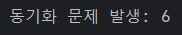
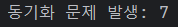
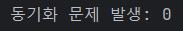
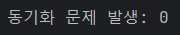
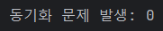

# 느긋한 계산법 (지연 평가)

---

## 느긋함(Laziness) & 엄격함(Strictness)
- 엄격한 계산은 변수 선언, 값을 할당, 표현식을 인수로 넘길 때 발생한다.
- 느긋한 계산은 표현식의 결과가 실제로 필요한 시점에 발생한다.
  - 표현식의 생성과 사용이 분리되어 있다.
```js
// JS
function add(x, y) {
    return x + x;
}

var result = add(5, 1/0); // 10
```
```java
// Java
int add(int x, int y) {
    return x + x;
}

int result = add(5, 1 / 0); // ArithmeticException
```
- 자바는 엄격한 언의 특성상 표현식을 즉시 계산한다.
  - 0을 나눌 수 없기 때문에 ArithmeticException이 발생한다.
- 엄격한 언어인 자바에서 람다표현식을 사용한다면 느긋한 계산을 할 수 있다.
```java
// 공급자를 사용한 느긋한 계산
public static void main(String[] args) {
    int result = add(() -> 5, () -> 1 / 0);
    System.out.println(result); // 10
}

static int add(IntSupplier x, IntSupplier y) {
    int actualX = x.getAsInt();
    return actualX + actualX;
}
```
- IntSupplier 인스턴스 선언은 엄격한 구문으로 즉시 계산된다.
- 하지만 람다의 실제 바디는 getAsInt로 명시적으로 호출되기 전까진 계산되지 않는다.

> 엄격성은 `해야 할 일을 즉시 실행`하는 것에 중점을 두고, <br>
> 느긋함은 `할 일을 고려하는 것`에 중점을 둔다.

## 자바의 Laziness
- 자바는 일반적으로 엄격한 언어이지만, 느긋한 특성도 존재한다.

### 단축 평가 계산
- &&, || 는 논리 연산에 활용되며, 연산자들은 피연산자를 왼쪽에서 오른쪽으로, 그리고 필요한 만큼만 계산한다.
- 연산자의 왼쪽의 표현식만으로 논리 표현식이 만족된다면 오른쪽 피연산자는 전혀 계산되지 않는다.

### 제어 구조
- 코드의 명령을 실행하는 방식을 변경한다.
- if-else 구조의 모든 부분은 선언될 때 즉시 평가되지 않고, 조건 분기를 유지하는 데 사용된다.

### JDK의 느긋한 타입

**Map**
- 일반적인 느긋함과는 다를 수 있으나, Map은 `필요할 때 값을 계산하거나 가져오는 방식`으로 설명될 수 있어 느긋함과 비슷한 특성을 가진다.
```java
Map<String, Integer> map = new HashMap<>();

// 키가 존재하지 않을 때만 값을 계산하여 삽입
map.computeIfAbsent("key1", k -> {
    return 42;
});

System.out.println(map.get("key1")); // 42

// 키가 존재하는 경우 계산하지 않는다.
map.computeIfAbsent("key1", k -> {
    return 100;
});

System.out.println(map.get("key1")); // 42
```
- computeIfAbsent 메서드는 특정 키에 대한 값이 존재하지 않을 때만 계산하여 값을 저장한다.
- 필요할 때만 계산을 수행하는 느긋한 계산 방식과 유사하다.

**스트림**
- 비용이 많이 드는 함수형 연산으로 이루어진 복잡한 스트림 구조를 정의할 수 있으며, 이러한 작업은 종료 연산을 호출한 후에만 평가를 시작할 수 있다.

**Optional**
- null 값을 처리하는 Optional은 일반적으로 느긋한 특성을 가지지 않는다.
- 하지만 orElseGet, orElseThrow 메서드와 같은 느긋한 연산을 사용할 수 있다.

### 람다의 느긋한 특성
- 람다 표현식의 선언문은 문장이기 때문에 엄격하게 평가된다.
- 그러나 람다 표현식의 바디, 즉 단일 추상 메서드는 실제 로직을 캡슐화하여 필요에 따라 평가한다.
```java
public static void main(String[] args) {
  // 람다 표현식을 사용하여 Supplier 선언
  // 바디는 아직 실행되지 않는다.
  Supplier<String> lazyValue = () -> {
      System.out.println("Calculating...");
      return "Computed Value";
  };
  
  Optional<String> optional = Optional.empty();

  // orElseGet은 값이 없을 때만 Supplier를 실행
  System.out.println("Before orElseGet");
  String result = optional.orElseGet(lazyValue);
  System.out.println("After orElseGet");
  
  System.out.println("Result: " + result);
}
// Before orElseGet
// Calculating...
// After orElseGet
// Result: Computed Value
```
- 만약 optional이 값을 가지고 있었다면, lazyValue는 실행되지 않았을 것이다.
  - 필요할 때만 실행되는 느긋한 평가의 특성을 가진다.

## Thunk를 사용한 지연 실행
- 람다 표현식은 지연 평가를 위해 표현식을 캡슐화하는 방법이다.
- 하지만 함수 계산 후 결과를 저장하지는 않는데,
- 만약 값비싼 함수를 매번 계산해야한다면 성능 저하의 우려가 있다.
  - 메모이제이션되지 않는다.
> 메모이제이션<br>
> 값비싼 함수 호출의 결과를 캐싱하고 동일한 입력이 다시 발생할 때 불필요하게 다시 계산하는 대신 캐싱된 결과를 반환하는 프로그래밍 기술
- 이때 Thunk가 사용되는데, Thunk는 연산을 감싸는 래퍼로, 기존 람다와 같이 연산을 지연시키기 위해 사용된다.
- 함수를 여러 번 호출하는 Supplier와는 달리, Thunk는 한 번만 계산되며 결과는 캐시되어 이후의 호출에서는 캐시된 결과를 반환한다.
```java
public class Thunk<T> implements Supplier<T> {

    private final Supplier<T> expression;

    private T result; // 함수 계산 후 결과 저장

    public Thunk(Supplier<T> expression) {
        this.expression = expression;
    }

    @Override
    public T get() {
        if (this.result == null) {
            this.result = this.expression.get();
        }
        return this.result;
    }

    public static <T> Thunk<T> of(Supplier<T> expression) {
        if (expression instanceof Thunk<T>) {
            return (Thunk<T>) expression;
        }

        return new Thunk<T>(expression);
    }
}
```
```java
public class ThunkEx {

    public static void main(String[] args) {

        Thunk<String> expensiveOperation = Thunk.of(ThunkEx::performExpensiveOperation);

        System.out.println("Before calling the thunk");

        String result = expensiveOperation.get();
        System.out.println("Result: " + result);

        // 캐시된 결과 반환
        System.out.println("Cached Result: " + expensiveOperation.get());
    }

    private static String performExpensiveOperation() {
        System.out.println("비용이 많이 드는 작업이야!");
        return "비용이 많이 들었지만 해냈어..";
    }
}
```

### 안전한 스레드 Thunk
- 단일 스레드 환경에서의 Thunk는 위 코드의 의도대로 동작한다.
- 그러나 식을 평가하는 동안 다른 스레드에서 접근한다면 경쟁 조건으로 인해 함수가 다시 계산될 수 있다.
- 이를 방지하기 위해 액세스하는 모든 스레드를 동기화하는 것이다.
- 가장 간단한 방법으로 get 메서드에 synchronized 키워드를 추가하는 것이다.
```java
@Override
public synchronized T get() {
    if (this.result == null) {
        this.result = this.expression.get();
    }
    return this.result;
}
```
- 하지만 함수 계산이 완료된 경우에도 항상 동기화와 관련된 오버헤드가 발생한다.
- 결과를 반환할 때가 아닌 함수가 계산,평가될 때 동기화하는 것이 좋다.
- 이전 버전의 Thunk는 expression이 이미 평가되었는지를 확인하기 위해 result를 사용했다.
- 아래의 스레드 안전한 버전에서는 저장된 값을 저장하고 전용 추상화(Hodler)로 대체하여 값(value)을 저장한다.
- Holder<T>는 Supplier<T>를 상속함으로써, 기존 expression 필드에 대한 대체가 가능하다.-> compare&swap(CAS)
  - `compare&swap(CAS)` : 변수의 값과 기대되는 값을 비교하고 두 값이 같다면 새로운 값으로 교체하는 방식
  - 동시성 알고리즘을 설계하는 데 사용된다.
```java
public class SynchronizedThunk<T> implements Supplier<T> {

    private static class Holder<T> implements Supplier<T> {
        private final T value;

        Holder(T value) {
            this.value = value;
        }

        @Override
        public T get() {
            return this.value;
        }
    }

    private Supplier<T> holder;

    private int count; // 동기화 테스트를 위한 count

    public SynchronizedThunk(Supplier<T> expression) {
        this.holder = () -> evaluate(expression);
    }
    
    private synchronized T evaluate(Supplier<T> expression) {
        // holder 필드가 현재 Holder 인스턴스가 아닌 경우에만 평가된다.
        if (!Holder.class.isInstance(this.holder)) {
            count++; // 평가될 때마다 count
            var evaluated = expression.get();
            this.holder = new Holder<>(evaluated); // Holder 인스턴스로 교체
        }

        return this.holder.get();
    }

    @Override
    public T get() {
        return this.holder.get();
    }

    public int getCount() {
        return count;
    }
}
```
```java
public class SynchronizedThunkEx {

    public static void main(String[] args) throws InterruptedException {
        // 기존 Thunk
        //Thunk<String> expensiveOperation = Thunk.of(SynchronizedThunkEx::performExpensiveOperation);

        // 스레드 안전 Thunk
        SynchronizedThunk<String> expensiveOperation = new SynchronizedThunk<>(SynchronizedThunkEx::performExpensiveOperation);

        // 스레드 풀 생성
        ExecutorService executor = Executors.newFixedThreadPool(10);

        // 여러 스레드에서 Thunk의 get 메서드 호출
        for (int i = 0; i < 10; i++) {
            executor.submit(() -> {
                String result = expensiveOperation.get();
                System.out.println("Result: " + result);
            });
        }

        // 스레드 풀 종료
        executor.shutdown();
        executor.awaitTermination(1, TimeUnit.MINUTES);

        // Thunk를 다시 호출해도 이미 계산된 결과 반환
        System.out.println("Cached Result: " + expensiveOperation.get());
        System.out.println("둥기화 문제 발생: " + (expensiveOperation.getCount() - 1));

    }

    private static String performExpensiveOperation() {
        System.out.println("비용이 많이 드는 작업이야!");

        try {
            Thread.sleep(1000); // 1초 지연
        } catch (InterruptedException e) {
            Thread.currentThread().interrupt();
        }
        return "비용이 많이 들었지만 해냈어..";
    }
}
```
- 기존 Thunk 테스트 결과



- 스레드 안전 Thunk 테스트 결과




- 첫번째 접근에서 holder 필드는 evaluate 를 호출하는데, 이 메서드는 동기화되어 있어 스레드 안전을 보장한다.
- 표현식이 평가되는 동안 추가되는 호출은 모두 evaluate 를 호출한다.
- 평가를 다시하는 대신, holder 필드의 타입 검사가 this.holder.get() 호출 결과를 직접 반환한다.

---

엄격함(열정적인 평가)은 선형적이고 체계적인 성능 평가를 가능하게 한다.

느긋함은 실제 계산 비용을 표현식이 정의되는 시점에서 사용되는 순간으로 옮겨, 코드가 전혀 실행되지 않을 가능성을 내포한다. -> 성능 평가가 어렵다.

계산 비용이 많이 들지만 선택적으로 실행되는 함수의 경우 느긋함을 선택한다면 성능이 좋아질 가능성이 높다.

엄격한 평가와 느긋한 평가는 한정된 자원을 효과적으로 활용하여 성능을 최적화할 수 있는 강력한 도구이다.
