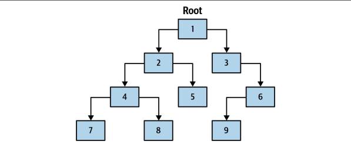

# 재귀

---

### 개념
- 함수가 자기 자신을 호출하는 프로그래밍 기법
- 문제를 작은 하위 문제들로 나누어 해결하는데 유용하며, `반복적으로 동일한 작업을 수행해야 하는 경우` 사용된다.

### 재귀의 기본 구조
- **기본 사례(Base Case)**: 재귀 호출을 멈추는 조건으로, 기본 사례가 없으면 재귀 호출이 무한 반복될 수 있다.
- **재귀 사례(Recursive Case)**: 함수가 자기 자신을 호출하는 부분이다. 이 부분에서 문제를 더 작은 부분으로 나눌 수 있다.
```java
public class FactorialEx {
    public static void main(String[] args) {
        int number = 5;
        int result = factorial(number);
        System.out.println("Factorial of " + number + " is " + result);
        // Factorial of 5 is 120
    }

    static int factorial(int n) {
        if (n == 0) { // 기본 사례
            return 1;
        } else { // 재귀 사례
            return n * factorial(n - 1); // n! = n * (n-1) * (n-2) * ... * 1
        }
    }
}
```
- 재귀를 사용하여 복잡한 문제를 더 작은 문제로 분할하여 해결할 수 있다.
- 하지만 성능 문제, 메모리 사용에 단점이 있다.
  - 성능 문제: 재귀 호출은 함수 호출 스택을 사용하기 때문에, 깊은 재귀는 Stackoverflow를 초래할 수 있다.
  - 메모리 사용: 재귀 호출마다 새로운 스택 프레임을 생성하므로, 메모리 사용량이 증가할 수 있다.

### 재귀 최적화

**꼬리 재귀 최적화**
```java
public class FactorialTailEx {
    public static void main(String[] args) {
        int number = 5;
        int result = factorial(number);
        System.out.println("Factorial of " + number + " is " + result);
        // Factorial of 5 is 120
    }

    static int factorialTail(int n, int accumulator) {
        if (n == 0) {
            return accumulator;
        } else {
            return factorialTail(n - 1, n * accumulator);
        }
    }
}
```
- 기존 factorial 메서드에서는 가장 깊은 호출이 완료된 후에 반환값을 통해 각 호출의 결과를 계산한다.
- 이 과정에서 `모든 재귀 호출이 종료된 후 스택 프레임을 따라 올라가며 계산이 수행`된다.
- 반면, 꼬리 재귀에서는 가장 깊은 호출이 마지막 작업으로, 스택 프레임을 따라 올라가지 않고 계산된 accumulator가 반환된다.
- 가장 `마지막으로 호출된 스택 프레임을 재사용`함으로써, 메모리 사용을 최적화할 수 있다.

## 반복 트리 순회 vs 재귀 트리 순회

- 사진의 트리 구조는 단일 루트 노드를 가지며, 각 노드는 왼쪽과 오른쪽 자식 노드를 가질 수 있다.
- 반복문과 재귀를 사용해 트리 구조를 중위 순회해보자.
>중위 순회 : 각 노드의 왼쪽 자식 노드를 먼저 순회한 후, 왼쪽 노드가 없을 때까지 계속하는 과정
```java
public record Node<T>(T value, Node<T> left, Node<T> right) {

    public static <T> Node<T> of(T value, Node<T> left, Node<T> right) {
        return new Node<>(value, left, right);
    }

    public static <T> Node<T> of(T value) {
        return new Node<>(value, null, null);
    }

    public static <T> Node<T> left(T value, Node<T> left) {
        return new Node<>(value, left, null);
    }

    public static <T> Node<T> right(T value, Node<T> right) {
        return new Node<>(value, null, right);
    }
}
```
```java
public class NodeEx {

    public static void main(String[] args) {
        Node<String> root = Node.of("1",
                Node.of("2",
                        Node.of("4",
                                Node.of("7"),
                                Node.of("8")),
                        Node.of("5")),
                Node.right("3",
                        Node.left("6",
                                Node.of("9"))));

        //traverseIterative(root);
        //traverseRecursion(root);
        
        // 748251396
    }

    // 반복 트리 순회
    static void traverseIterative(Node<String> root) {
        var temNodes = new Stack<Node<String>>(); // 반복의 현재 상태를 저장하기 위한 보조 변수
        var current = root;
        
        // 노드가 존재하지 않거나 nodeStack이 비어 있지 않을 때까지 반복
        while (!temNodes.isEmpty() || current != null) { // 가장 깊은 부분에 도달할 때까지 모든 노드를 저장
            if (current != null) {
                temNodes.push(current);
                current = current.left();
                continue;
            }

            // current == null을 만나면 temNodes에 저장된 마지막 노드를 current 로 설정
            current = temNodes.pop();

            // 노드 값 출력
            System.out.print(current.value());

            // 오른쪽 자식 노드로 이 과정을 반복한다.
            current = current.right();
        }
    }

    // 재귀 트리 순회
    static void traverseRecursion(Node<String> node) {
        // 남아있는 노드가 없을 때 트리 순회를 중단하는 기본 조건
        if (node == null) {
            return;
        }

        // 왼쪽 자식 노드를 재귀적을 순회
        // 왼쪽 노드가 존재하는 한 계속해서 traverseRecursion 호출 
        traverseRecursion(node.left());

        // 왼쪽 자식 노드가 없다면 현재 노드의 값을 출력
        System.out.print(node.value());

        // 같은 방식으로 오른쪽 자식 노드 순회
        traverseRecursion(node.right());
    }
}
```
- 반복와 재귀의 가장 큰 차이는 성능이다.
- traverseIterative 반복 순회 메서드는 temNodes 라는 보조변수를 사용하여 트리를 순회한다.
  - 동적으로 변경되는 `트리의 상태를 힙 영역에 저장`한다.
  - 힙 영역은 스택 영역보다 훨씬 큰 메모리 공간을 제공한다. 더 많은 메모리를 활용할 수 있으며 데이터의 크기가 큰 경우 적합하다.
- traverseRecursion 재귀 순회 메서드는 각 호출마다 새로운 스택 프레임을 생성하여 트리를 순회한다.
  - 스택 프레임은 호출 스택에 저장되며, `스택 영역을 사용`한다.
  - 각 호출마다 스택 프레임이 추가되고, 반환될 때마다 스택 프레임이 제거된다.
  - 깊은 재귀 호출이 많은 경우 스택오버플로우의 위험이 있다.

재귀와 반복 중 어느 것을 선택할지는 해결하고자 하는 문제의 성격과 코드 실행 환경에 따라 달라질 수 있다.<br>
재귀는 일반적으로 더 추상적인 문제를 해결하는 데 선호되는 도구이며, 반복은 저수준 코드에 더 적합하다.

>반복은 우수한 런타임 성능을 제공할 수 있지만, 재귀는 프로그래머의 생산성을 향상시킬 수 있다.