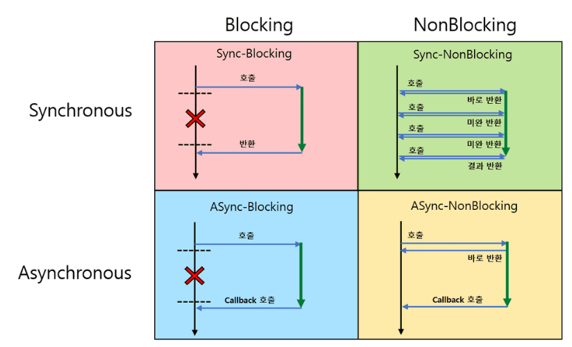
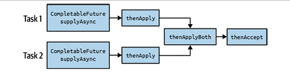

# 비동기 작업

---

## 동기 & 비동기

**동기(Synchronous)**
- 작업을 순차적으로 수행하며, 하나의 작업이 완료된 후에야 다음 작업을 시작할 수 있다.
- 호출한 작업이 완료될 때까지 호출자는 대기 상태에 있다.
- 작업의 결과를 즉시 반환받는다.

**비동기(Asynchronous)**
- 작업의 완료 여부와 관계없이 다음 작업을 시작하는 방식
- 작업의 완료를 콜백이나 이벤트를 통해 알림받는다.

순서와 결과처리의 관점

**Blocking**
- 자신의 작업을 진행하다가 다른 주체의 작업이 시작되면 다른 작업이 끝날 때까지 기다렸다가 자신의 작업을 시작한다.

**Non-Blocking**
- 다른 주체의 작업에 관련없이 자신의 작업을 하는 것

제어할 수 없는 대상의 처리 방법



- Sync-Blocking : 메인 프로세스에서 제어권이 넘어가 작업이 끝난 후 제어권을 다시 받는다.
- Sync-NonBlocking : 메인 프로세스에서 제어권을 넘겼다가 바로 받지만 호출된 기능의 완료에 관심을 보인다.
- Async-Blocking : 메인 프로세스에서 제어권이 넘어갔지만 호출된 기능의 완료에 관심을 갖지 않는다.
- Async-NonBlocking : 메인 프로세스에서 제어권을 넘겼다가 바로 받고 호출된 기능의 완료에 관심을 갖지 않는다.

## 자바의 Future
- 자바 5에 도입된 비동기 계산의 최종 결과를 담을 컨테이너 타입
- 별도의 스레드에서 작업을 시작하지만, 즉시 Future 인스턴스를 반환한다.
- 이 방식을 통해 현재 스레드는 Future 계산의 최종 결과를 기다리지 않고 더 많은 작업을 수행할 수 있다.
```java
public class FutureEx {

    public static void main(String[] args) throws ExecutionException, InterruptedException {
        ExecutorService executor = Executors.newFixedThreadPool(10);

        Callable<Integer> expensiveTask = () -> {
            System.out.println("Task start");

            TimeUnit.SECONDS.sleep(2);

            System.out.println("Task done");
            
            return 42;
        };

        System.out.println("before submitting the task");

        // expensiveTask의 계산은 즉시 시작되어 결괏값에 반영된다.
        Future<Integer> future = executor.submit(expensiveTask);

        System.out.println("after submitting the task");

        // 이 시점에서 계산은 아직 완료되지 않았으므로
        // future의 get 메서드를 호출하면 계산이 완료될 때까지 현재의 스레드가 차단된다.
        Integer theAnswer = future.get();

        System.out.println("after the blocking call future.get()");
    }
}
```
- Future 타입은 비동기 계산을 위한 NonBlocking 컨테이너로써 기본적인 요구 사항을 충족한다.
- 하지만 계산이 완료되었는지 확인하고 취소하며 결과를 검색하는 몇 가지 메서드의 기능만 제공한다.
- 효과적인 비동기 프로그래밍을 위해 다음과 같은 기능들이 추가적으로 필요할 수 있다
  - 완료 또는 실패 시 콜백과 같이 결과를 쉽게 확인할 수 있는 기능
  - 함수적 구성의 원칙에 따라 여러 작업을 연결하고 결합하는 방법
  - 통합된 오류 처리 및 복구 가능성
  - ExecutorService 없이도 수동으로 작업을 생성하거나 완료할 수 있는 방법
- 자바 8은 Future의 부족한 기능을 보완하기 위해 CompletionStage<T> 인터페이스와 그 구현체인 CompletableFuture<T> 를 도입.

## CompletableFuture

### 생성
- Future와 CompletableFuture는 인스턴스 생성 방법이 유사하지만, CompletableFuture는 ExecutorService를 필요로 하지 않아 더 간결한 특성을 가진다.
```java
// Future<T>
ForkJoinPool executorService = ForkJoinPool.commonPool(); //

Future<?> futureRunnable = executorService.submit(() -> System.out.println("not returning a value"));

Future<String> submit = executorService.submit(() -> "Hello, Async World!");

// CompletableFuture<T>
CompletableFuture<Void> completableFutureRunnable =
        CompletableFuture.runAsync(() -> System.out.println("not returning a value"));

CompletableFuture<String> completableFutureSupplier =
        CompletableFuture.supplyAsync(() -> "Hello, Async World!");
```

### 작업 합성 & 결합

**작업 합성**
- 작업을 합성한다는 것은 연결된 CompletionStage 인스턴스들로 구성된 순차적인 파이프라인을 만드는 것을 의미한다.
- 예로 오프라인 환경에서 youtube 영상을 보기 위해 저장하고, 저장이 완료됐다는 알림을 보내는 task를 구성해보자
  - 동영상 다운로드, 재생목록 저장, 알림 발송
```java
var task = CompletableFuture.supplyAsync(() -> this.downloadService.get(url))
                            .thenApply(this.storage::save)
                            .thenRun(this.messge::send)
```
- 작업 합성 연산은 1:1로만 작용하며, 이전 단계의 결과를 받아 목적에 맞게 작업을 수행한다.

**작업 결합**
- 작업이 결합되거나 연속적으로 실행될 필요가 없는 경우 다른 단계를 포함하는 연산을 사용하여 CompletionStage 인스턴스들을 결합할 수 있다.

