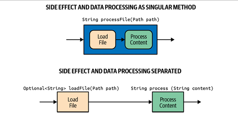

# 자바를 위한 함수형 접근 방식

---

## OOP & FP 원칙 비교

### OOP 원칙
- 데이터와 행동의 캡슐화, 다형성, 추상화에 집중
- 현실 세계의 문제를 모델링하기 위해 비유를 기반으로 문제 해결 방식 제공
- 객체는 인터페이스와 같은 공공 계약을 통해 상호작요하고, 자신의 상태를 관리하며 특정 책임을 가진다.
- OOP는 현실 세계를 반영하고 지속적인 변화를 처리하기 위해 코드를 구조화하고 조직화하는 데 효과적이다.

### FP 원칙
- 수학적 원리와 람다 계산법에 기반을 두고 데이터 변환에 중점을 둔다.
- 선언형 코드 스타일을 사용하며, 비유를 사용하는 대신 함수와 데이터 구조로 직접 모델링한다.
- FP로 변경 가능한 상태를 동시성 환경에서 처리하거나 예상치 못한 사이드 이펙트를 줄일 수 있다.

### OOP vs FP
- OOP는 현실 세계의 비유를 사용하여 복잡성을 캡슐화하는 반면, FP는 수학적 원칙을 따르면서 단순화를 추구한다.
- 두 패러다임 모두 각각의 장점을 가지고 동일한 문제를 해결할 수 있지만,
- 복잡한 문제는 FP의 추상화 접근보다 OOP의 비유적 표현을 사용했을 떄 더 큰 이점을 얻을 수 있다.

## 함수형 사고방식

### 함수는 일급 객체다
- FP는 함수를 일급 객체로 취급하는 프로그래밍 패러다임.
- 일급 객체란 다른 객체들에게 일반적으로 적용 가능한 연산을 모두 지원하는 객체이다.
  - 변수에 함수 할당
  - 다른 함수,메서드의 인수로 전달
  - 함수,메서드에서 함수 반환
  - 이름 없는 익명 함수 생성

### 사이드 이펙트 피하기
- 함수형 관점에서 사이드 이펙트는 다양한 형태로 나타낼 수 있는 상태 변경을 의미한다.

**1. 순수 함수**
- 사이드 이펙트를 방지하는 가장 기본적인 방법은 순수 함수를 사용하는 것이다.
  - 동일한 입력은 언제나 동일한 출력을 생성한다.
  - 순수 함수는 사이드 이펙트 없이 독립적으로 동작한다.
- 순수 함수는 오직 선언된 입력 인수에만 의존해야 한다.
```java
public String buildGreeting(User user) {
    String greeting;
    if (LocalTime.now().getHour() < 12) {
        greeting = "Good morning";
    } else {
        greeting = "Hello";
    }
        
    return String.format("%s, %s", greeting, user.name());
}
```
- 위의 코드는 전달받은 인수 외에 LocalTime 이라는 외부 의존성을 받는다.
- LocalTime에 따라 결과값은 달라질 수 있어 사이드 이펙트가 발생할 확률이 높다.
- 그리고 전달 받은 인수 User는 메서드 안에서 name만을 사용하고 있다.
- 특정 도메인 타입에 의존하기보다는 실제로 필요한 값을 받는 것이 좋다.

**2. 사이드 이펙트 격리**
- 사이드 이펙트가 발생하지 않는 애플리케이션을 만드는 것은 사실상 불가능하다.
- 순수 함수와 같은 기술로 사이트 이펙트를 완전히 피할 수 없다면 사이드 이펙트를 격리하는 것이 좋다.
- 더 큰 코드 단위를 작은 작업으로 나눔으로써, 사이드 이펙트는 특정 작업에만 국한되어 전체 단위에 영향을 미치지 않는다.
- 예로, 파일 로딩, DB 통신 등 작업을 하는 I/O는 사이드 이펙트를 일으킨다.
- 파일을 로드하고 데이터를 처리하는 작업을 분리하기보다는, 사이드 이펙트가 발생하는 파일 로딩 로직과 실제 데이터를 처리하는 로직을 분리하는 것이 더 바람직하다.


- 사이드 이펙트를 피할 수 없다면 가능한 한 작업을 더 작고 순수한 함수로 분할하여 남은 사이드 이펙트를 격리하고 캡슐화하는 것이 좋다.

**3. 불변성**
- 상태가 변하지 않는다면 사이드 이펙트는 발생하지 않는다.
- 불변성은 의도하지 않는 변경이라는 버그의 원인을 제거하여 코드를 더욱 견고하게 만들 수 있다.
- 특히 동시성 환경에서 사이드 이펙트를 방지하기 위해 모든 타입에 불변성을 기본 방식으로 삼아야 한다.
- 자바는 불변 자료 구조에 대한 다양한 옵션들을 제공한다.
  - 불변 컬렉션
    - 자바는 완전 불변 컬렉션 타입을 제공하지는 않지만 구조적으로 불변인 컬렉션을 제공한다.
    - 불변 컬렉션에서는 요소를 추가하거나 제거하는 것이 불가능하다.
    - 예를 들어, List.of 와 같은 정적 팩토리 메서드를 통해 구조적으로 불변인 컬렉션을 만들 수 있다.
  - 레코드
    - 모든 필드는 private으로 저장되며, 외부에서는 public 접근자 메서드를 통해서만 접근이 가능하다.
    - 내부적으로 java.lang.Record를 상속한 final 타입이다.
- 처음부터 불변성을 염두에 두고 설계한다면 사이드 이펙트를 방지할 수 있고 동시성 환경에서도 스레드 안전성을 보장할 수 있다.
