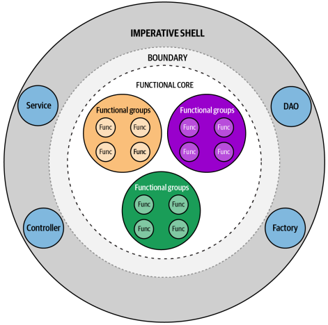

# 자바를 위한 함수형 접근 방식

---

## OOP & FP 원칙 비교

### OOP 원칙
- 데이터와 행동의 캡슐화, 다형성, 추상화에 집중
- 현실 세계의 문제를 모델링하기 위해 비유를 기반으로 문제 해결 방식 제공
- 객체는 인터페이스와 같은 공공 계약을 통해 상호작요하고, 자신의 상태를 관리하며 특정 책임을 가진다.
- OOP는 현실 세계를 반영하고 지속적인 변화를 처리하기 위해 코드를 구조화하고 조직화하는 데 효과적이다.

### FP 원칙
- 수학적 원리와 람다 계산법에 기반을 두고 데이터 변환에 중점을 둔다.
- 선언형 코드 스타일을 사용하며, 비유를 사용하는 대신 함수와 데이터 구조로 직접 모델링한다.
- FP로 변경 가능한 상태를 동시성 환경에서 처리하거나 예상치 못한 사이드 이펙트를 줄일 수 있다.

### OOP vs FP
- OOP는 현실 세계의 비유를 사용하여 복잡성을 캡슐화하는 반면, FP는 수학적 원칙을 따르면서 단순화를 추구한다.
- 두 패러다임 모두 각각의 장점을 가지고 동일한 문제를 해결할 수 있지만,
- 복잡한 문제는 FP의 추상화 접근보다 OOP의 비유적 표현을 사용했을 떄 더 큰 이점을 얻을 수 있다.

## 함수형 사고방식

### 함수는 일급 객체다
- FP는 함수를 일급 객체로 취급하는 프로그래밍 패러다임.
- 일급 객체란 다른 객체들에게 일반적으로 적용 가능한 연산을 모두 지원하는 객체이다.
  - 변수에 함수 할당
  - 다른 함수,메서드의 인수로 전달
  - 함수,메서드에서 함수 반환
  - 이름 없는 익명 함수 생성

### 사이드 이펙트 피하기
- 함수형 관점에서 사이드 이펙트는 다양한 형태로 나타낼 수 있는 상태 변경을 의미한다.

**1. 순수 함수**
- 사이드 이펙트를 방지하는 가장 기본적인 방법은 순수 함수를 사용하는 것이다.
  - 동일한 입력은 언제나 동일한 출력을 생성한다.
  - 순수 함수는 사이드 이펙트 없이 독립적으로 동작한다.
- 순수 함수는 오직 선언된 입력 인수에만 의존해야 한다.
```java
public String buildGreeting(User user) {
    String greeting;
    if (LocalTime.now().getHour() < 12) {
        greeting = "Good morning";
    } else {
        greeting = "Hello";
    }
        
    return String.format("%s, %s", greeting, user.name());
}
```
- 위의 코드는 전달받은 인수 외에 LocalTime 이라는 외부 의존성을 받는다.
- LocalTime에 따라 결과값은 달라질 수 있어 사이드 이펙트가 발생할 확률이 높다.
- 그리고 전달 받은 인수 User는 메서드 안에서 name만을 사용하고 있다.
- 특정 도메인 타입에 의존하기보다는 실제로 필요한 값을 받는 것이 좋다.

**2. 사이드 이펙트 격리**
- 사이드 이펙트가 발생하지 않는 애플리케이션을 만드는 것은 사실상 불가능하다.
- 순수 함수와 같은 기술로 사이트 이펙트를 완전히 피할 수 없다면 사이드 이펙트를 격리하는 것이 좋다.
- 더 큰 코드 단위를 작은 작업으로 나눔으로써, 사이드 이펙트는 특정 작업에만 국한되어 전체 단위에 영향을 미치지 않는다.
- 예로, 파일 로딩, DB 통신 등 작업을 하는 I/O는 사이드 이펙트를 일으킨다.
- 파일을 로드하고 데이터를 처리하는 작업을 분리하기보다는, 사이드 이펙트가 발생하는 파일 로딩 로직과 실제 데이터를 처리하는 로직을 분리하는 것이 더 바람직하다.


- 사이드 이펙트를 피할 수 없다면 가능한 한 작업을 더 작고 순수한 함수로 분할하여 남은 사이드 이펙트를 격리하고 캡슐화하는 것이 좋다.

**3. 불변성**
- 상태가 변하지 않는다면 사이드 이펙트는 발생하지 않는다.
- 불변성은 의도하지 않는 변경이라는 버그의 원인을 제거하여 코드를 더욱 견고하게 만들 수 있다.
- 특히 동시성 환경에서 사이드 이펙트를 방지하기 위해 모든 타입에 불변성을 기본 방식으로 삼아야 한다.
- 자바는 불변 자료 구조에 대한 다양한 옵션들을 제공한다.
  - 불변 컬렉션
    - 자바는 완전 불변 컬렉션 타입을 제공하지는 않지만 구조적으로 불변인 컬렉션을 제공한다.
    - 불변 컬렉션에서는 요소를 추가하거나 제거하는 것이 불가능하다.
    - 예를 들어, List.of 와 같은 정적 팩토리 메서드를 통해 구조적으로 불변인 컬렉션을 만들 수 있다.
  - 레코드
    - 모든 필드는 private으로 저장되며, 외부에서는 public 접근자 메서드를 통해서만 접근이 가능하다.
    - 내부적으로 java.lang.Record를 상속한 final 타입이다.
- 처음부터 불변성을 염두에 두고 설계한다면 사이드 이펙트를 방지할 수 있고 동시성 환경에서도 스레드 안전성을 보장할 수 있다.

### 함수형 연결고리 만들기

**메서드 참조 친화적 시그니처**
- 모든 메서드와 생성자는 잠재적인 메서드 참조이다. 이는 고차 함수에서 사용되거나 함수형 인터페이스로 표현될 수 있다.
- 그렇기 때문에 다른 함수형 API를 염두에 두고 API를 설계하는 것은 의미가 있다.
- 예를 들어 스트림 연산인 map,filer,sort는 각각 Function<T,R>, Predicate<T>, Comparator<T>를 받아들이고, 간단한 메서드 시그니처로 변환할 수 있다.

**기존의 함수형 인터페이스 사용**
- @FunctionalInterface는 인터페이스를 명시적으로 함수형 인터페이스로 선언한다.
  - 하나의 추상 메서드만 가지도록 강제한다. 만약 두 개 이상의 추상 메서드가 있다면 컴파일 오류가 발생한다.
- 이러한 강제성이 있지만 @FunctionalInterface은 기존 인터페이스의 하위 호환성을 보장하는데,
- 인터페이스가 SAM 요구 사항을 충족한다면 @FunctionalInterface가 없어도 하나의 추상 메서드가 있을 경우 자동으로 함수형 인터페이스로 간주된다.
  - default, static 메서드로 부족한 기능을 보완할 수 있다.
- 자바 8 이전부터 사용되었던 Comparable, Runnable, Conparator, Callable 인터페이스는 현재 함수형 인터페이스로 간주된다.
- 자바 8은 새로운 함수형 인터페이스 도입뿐만 아니라, 기존 인터페이스도 개선하여 더 함수적으로 코드를 작성할 수 있게 했다.

**함수형 null 처리를 위한 Optional 사용**
- 기존에는 null 참조가 NullPointException을 발생시키지 않기 위해 사용되는 추가적인 코드였다.
- Optional을 도입함으로써 null 값을 처리하기 위한 기존의 복잡한 코드 대신 명확한 선언형 파이프라인을 제공한다.
- 하지만 Optional은 모든 null 관련 코드의 보편적인 대체재로 의도된 것은 아니다.
- Optional은 잠재적인 null 값에 대한 개선된 반환 컨테이너로써의 역할과 Optional 파이프라인에 대한 용도로 제한되어야 한다.

### 병렬성과 동시성
- 병렬성과 동시성에 관련된 대부분의 문제는 서로 다른 스레드 간의 데이터를 공유하는 것에서 발생한다.
- 여러 스레드가 데이터를 공유할 때, 동기화와 락을 사용해 데이터 무결성을 보장하고 데이터 경합, 데드락 상황을 방지해야 한다.
- 함수형 프로그래밍은 불변성과 순수 함수 같은 원칙 덕분에 동시성과 병렬성을 비교적 안전하게 사용할 수 있다.
  - 불변성은 데이터 경합과 데드락을 방지하고, 순수 함수는 사이드 이펙트가 없어 어떤 스레드에서도 안전하게 호출될 수 있다.

### 잠재적인 오버헤드 주의
- 함수형 프로그래밍 기술은 코드의 생산성을 높이고 더 표현력 있게, 코드를 견고하게 만들어 준다.
- 하지만 이는 더 높은 성능을 보장하지 않으며, 명령형이나 객체 지향 코드와 같은 성능을 가진다는 것은 아니다.
  - 그렇다고 최적화되지 않았다는 것을 의미하지는 않는다. 람다는 JVM에서 특별한 바이트 코드(opcode) 를 사용하고 여러 최적화 기술을 활용한다.
- 스트림과 Optional을 사용하여 데이터 처리나 null 검사 코드를 함수적으로 작성할 수 있지만 추가적인 객체 생성, 메서드 호출 등으로 인해 오버헤드가 발생할 수 있다.

## 명령형 세계의 함수형 아키텍처
기존의 명령형 및 객체 지향 코드 베이스에 맞는 기능적 접근 방식을 적용하려면 상태를 크게 변경하지 않도록 해야 한다.

함수형 아키텍처의 중요한 단위는 함수로, 이는 비즈니스 로직의 독립된 조각을 나타낸다.<br>
각 워크플로우는 기능적 조각들을 필요에 따라 조합하여 더 큰 논리적 단위를 형성한다.

객체 지향 세계에서 함수형 프로그래밍을 활용하는 아키텍처 접근 방식은 비즈니스 로직을 외부와의 통신 방식에서 분리하는 것이다.<br>
함수형 코어(FC)와 명령형 쉘(IS) 접근 방식은 유연하고 기존 코드 베이스에 통합될 수 있다.

코드와 그 실제 목적을 어떤 패러다임이나 개념으로부터 분리하여 생각하면 작업을 수행하는 것과 그것을 조정하는 것으로 나뉜다.



**함수형 코어**
- 비즈니스 로직과 결정을 순수 함수와 불변성을 활용하여 캡슐화하고, 이로 인해 사이드 이펙트나 상태 관련 문제에 대해 걱정 없이 데이터를 직접 처리한다.
- 이 코어는 외부 환경으로부터 보호되는 얇은 레이어인 명령형 쉘로 감싸진다.

**명령형 쉘**
- 시스템의 다른 부분에 대한 의존성을 포함하고, 외부에서 FC/IS와 상효작용하기 위한 공개 계약을 제공한다.
- 모든 비기능적 요소는 코어로부터 멀리 유지되고 쉘로 제한된다.
- 쉘은 코어의 경계를 통해 작업을 위임하고 코어의 결과를 해석하는 역할을 담당한다.

이 디자인의 주요 장점은 `책임의 명확한 분리`이다.<br>
비즈니스 로직은 순수 함수와 불변성으로 구성된 코어에 캡슐화되어 있어 유지보수가 용이하다.<br>
반면, 불순한 요소나 가변적인 것, 다른 시스템과의 접촉은 모두 쉘에 한정되며, 쉘 자체는 스스로 많은 결정을 내리지 못하도록 제한된다.

